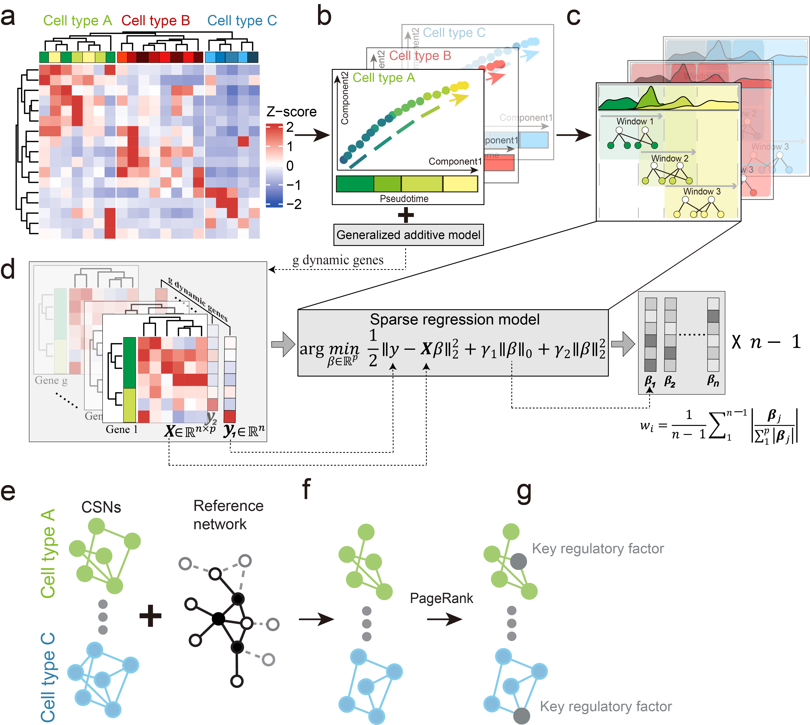

# ***inferCSN***

[](https://github.com/mengxu98/inferCSN/actions/workflows/R-CMD-check.yaml) [](https://github.com/mengxu98/inferCSN/actions/workflows/test-coverage.yaml) [](https://img.shields.io/badge/-R-75aadb) [](https://img.shields.io/badge/-Gene%20Regulatory%20Network-blue) 

## Install

``` r
# install.packages("devtools")
devtools::install_github("wiscstatman/EBSeq")
devtools::install_github("hazimehh/L0Learn")
devtools::install_github("mengxu98/inferCSN")
```
