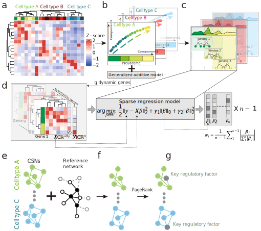

# ***inferCSN*** 

<!-- badges: start -->

[](https://github.com/cran/inferCSN) [](https://github.com/mengxu98/inferCSN/actions/workflows/R-CMD-check.yaml) [](https://github.com/mengxu98/inferCSN/actions/workflows/test-coverage.yaml) [](https://mengxu98.github.io/inferCSN/reference/index.html)
[](https://CRAN.R-project.org/package=inferCSN)

<!-- badges: end -->

## **Introduction**

[*`inferCSN`*](https://mengxu98.github.io/inferCSN/) is an package for inferring cell-specific gene regulatory network from single-cell sequencing data.



## **Installation**

You can install the released version from [*`CRAN`*](https://github.com/cran) use:

``` r
install.packages("inferCSN")
```

You can install the development version from [*`GitHub`*](https://github.com/mengxu98/inferCSN) use [*`pak`*](https://github.com/r-lib/pak):

``` r
if (!require("pak", quietly = TRUE)) {
  install.packages("pak")
}
pak::pak("mengxu98/inferCSN")
```

## **Usage**

How to use [*`inferCSN`*](https://mengxu98.github.io/inferCSN/)? Please reference [*`here`*](https://mengxu98.github.io/inferCSN/reference/index.html).

## **Cite**

If you use [*`inferCSN`*](https://github.com/mengxu98/inferCSN) in your work, please cite it reference [*`here`*](https://github.com/mengxu98/inferCSN/blob/main/src/README.cpp).
